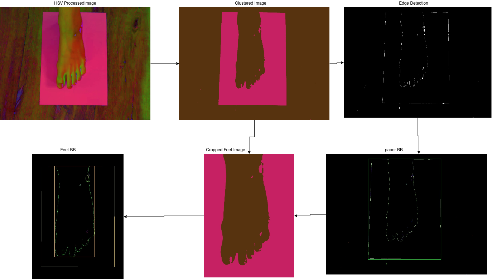
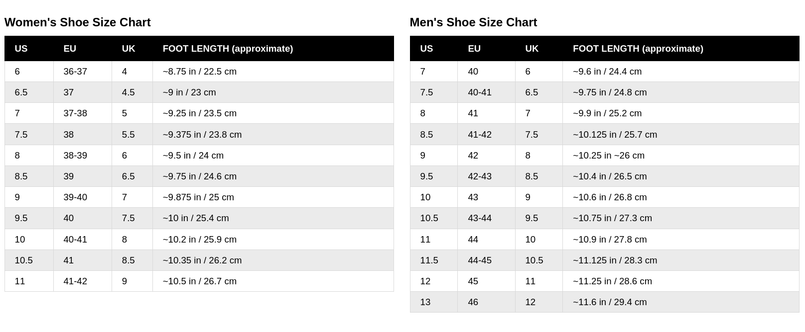
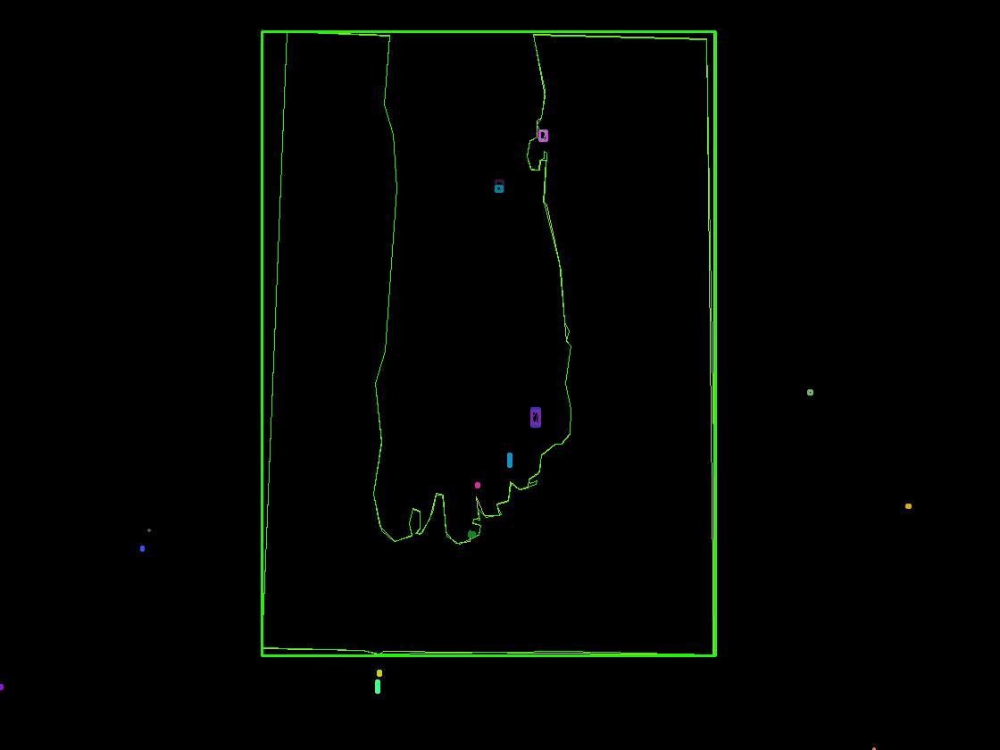

# FeetAndShoeMeasurement - Feet and Shoe size measurements without Deep Learning
**Problem** : Determine the Feet and corresponding Shoe size of a person without Deep Learning, given a image clicked by the person itself. 

## How to Evaluate?
* Clone the repo
* Install required packages: `pip install opencv-python scikit-learn scikit-image matplotlib imutils`
* Put any image in the "data" folder
* Run: `python main.py your_image.jpg` or just `python main.py` to see available images

## Usage Examples
```bash
# Test with specific image
python main.py my_foot_photo.jpg

# See all available images and use default
python main.py

# The program will show:
# - Image dimensions
# - Processing steps
# - Calculated foot size in cm
# - Estimated shoe size
# - Warning if measurement seems incorrect
```

### Hybrid two-photo pipeline
The updated pipeline can combine a top view of the foot with a side view. The top
view is used to measure width and evaluate the plantar arch, while the side view
provides the length, arch height and arch angle. Example usage:

```python
from mobile_sam_podiatry import MobileSAMPodiatryPipeline

pipeline = MobileSAMPodiatryPipeline()
result = pipeline.process_hybrid_views('top.jpg', 'side.jpg')
print(result)
```

## Working Aproach
* convert raw image to HSV format
* Remove noise using Gaussian Blur
* Run k-means clustering on preprocessed image for color based segmentation
* Detect the edges in clustered image. 
* Find contours in Edge Detection output 
* Generate the bounding Box to get the height/width of Paper and Feet

## Libraries used
* OpenCV
* Sklearn

## Assumptions
* Printer Paper is used as a reference (Height/Width is known and White background will help in Preprocessing)
* Foot should be in center, touching one edge of paper.
* Floor color should be different than white. 
* Image should be clicked form top angle. 
* Paper should be completely visible in the clicked image. 

## Sample outputs

<p align="center">
  
</p>

## Shoe Size charts for Mens and Womens
**Designed Solution gives feet size in CM's, that can be compared with below chart for Corresponding Shoe Size**
<p align="center">
  
</p> 

## Testing Any Image
**NEW**: You can now test any image! The program will:
- ✅ Accept any image format (jpg, png, etc.)
- ✅ Show processing steps with progress
- ✅ Estimate shoe size automatically
- ✅ Warn if measurement seems incorrect
- ✅ Save all processing steps to `output/` folder

**Note**: For accurate measurements, follow the assumptions above. For testing purposes, any image will be processed but results may vary.

## Limitations
* If floor color is white, then it will difficult to segment the paper. 
* Feet should not go out of the paper. Currently A4 size printer paper has ben chosen as reference. To fit all sizes, A1 paper can be taken as reference.
* If there is no closed curv after edge detection, its difficult to find bounding box. Only closed curv is considered as a contour. And bounding box is generated on top of that. As it can be seen in the below image, bounding box is not generated on feet but only on the paper.
<p align="center">
  
</p>  

## Other Ideas
* Deep learning models (Trained on feet and shoe Dataset) can be used to segment the paper and feet with more accuracy. One can use "[Part Grouping Network](https://arxiv.org/abs/1808.00157)" 

## References 
* OpenCV - https://docs.opencv.org/3.4/d4/d73/tutorial_py_contours_begin.html
* Part grouping Network - [Paper](https://arxiv.org/abs/1808.00157)
